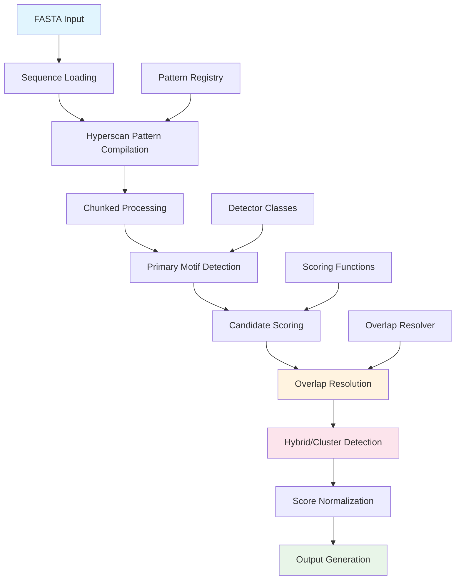

# Non-B DNA Motif Detection: Complete Documentation

## Overview

NBDFinder is a comprehensive tool for detecting non-B DNA structures in genomic sequences. This document provides detailed definitions, classifications, and technical specifications for all supported motif classes and subclasses.

## Detection Pipeline Flow

## Motif Class Definitions

### Class 1: G-Quadruplex (G4)
**Definition**: Four-stranded DNA secondary structures formed by guanine-rich sequences through Hoogsteen hydrogen bonding.

**Biological Significance**: 
- Involved in telomere maintenance
- Regulatory roles in gene expression
- Potential therapeutic targets

**Detection Method**: G4Hunter algorithm with pattern matching

| Subclass | Definition | Pattern Example | Scoring Method |
|----------|------------|-----------------|----------------|
| Canonical_G4 | Classical G4 with 4 G-tracts | `G{3,}N{1,7}G{3,}N{1,7}G{3,}N{1,7}G{3,}` | G4Hunter score |
| Relaxed_G4 | G4 with relaxed constraints | `G{2,}N{1,12}G{2,}N{1,12}G{2,}N{1,12}G{2,}` | Modified G4Hunter |
| Bulged_G4 | G4 with bulge loops | Complex patterns with interruptions | Stability scoring |
| Bipartite_G4 | Split G4 across regions | Distance-based detection | Cooperative scoring |
| Multimeric_G4 | Multiple G4 units | Clustered G4 patterns | Aggregate scoring |
| Imperfect_G4 | G4 with mismatches | Fuzzy pattern matching | Penalty-adjusted scoring |

### Class 2: Curved DNA
**Definition**: DNA sequences that deviate from the normal B-form helix, creating intrinsic bends.

**Biological Significance**:
- Protein binding sites
- Chromatin structure regulation
- Transcriptional control

**Detection Method**: A-tract periodicity analysis

| Subclass | Definition | Pattern | Scoring Method |
|----------|------------|---------|----------------|
| A_phased_repeats | A-tracts with 10bp spacing | `A{4,}N{6,10}A{4,}` | Curvature prediction |
| Curved_AT_rich | AT-rich curved regions | Complex AT patterns | Flexibility scoring |

### Class 3: Slipped DNA
**Definition**: Secondary structures formed by repetitive sequences that can slip during replication.

**Biological Significance**:
- Associated with repeat expansion diseases
- Microsatellite instability
- Evolutionary mechanisms

**Detection Method**: Tandem repeat analysis

| Subclass | Definition | Pattern | Scoring Method |
|----------|------------|---------|----------------|
| STR_slipped | Short tandem repeats | `(N{1,6}){3,}` | Repeat stability |
| Direct_repeats | Direct sequence repeats | Exact or near-exact matches | Homology scoring |

### Class 4: Cruciform DNA
**Definition**: Four-way junction structures formed by inverted repeat sequences.

**Biological Significance**:
- Recombination hotspots
- Chromosome rearrangements
- DNA repair processes

**Detection Method**: Palindrome detection with gap analysis

| Subclass | Definition | Pattern | Scoring Method |
|----------|------------|---------|----------------|
| Palindromes | Perfect inverted repeats | Palindromic sequences | Symmetry scoring |
| Inverted_repeats | Imperfect inverted repeats | Near-palindromic | Mismatch penalty |

### Class 5: R-loops
**Definition**: Three-stranded nucleic acid structures containing RNA-DNA hybrids and displaced single-stranded DNA.

**Biological Significance**:
- Transcription regulation
- DNA damage and instability
- Immune activation

**Detection Method**: RLFS (R-loop Forming Sequence) models

| Subclass | Definition | Characteristics | Scoring Method |
|----------|------------|----------------|----------------|
| RLFS_predicted | Computationally predicted | GC skew, length criteria | RLFS algorithm |
| GC_skew_regions | Regions with GC bias | Strand-specific GC content | Skew calculation |

### Class 6: Triplex DNA
**Definition**: Triple-stranded DNA structures formed by Hoogsteen base pairing.

**Biological Significance**:
- Gene regulation
- Chromosomal structure
- Potential therapeutic applications

**Detection Method**: Homopurine/homopyrimidine tract analysis

| Subclass | Definition | Pattern | Scoring Method |
|----------|------------|---------|----------------|
| Homopurine | Purine-rich sequences | `[AG]{15,}` | Triplex stability |
| Homopyrimidine | Pyrimidine-rich sequences | `[CT]{15,}` | Binding affinity |
| GA_rich | GA-rich triplex motifs | `[GA]{15,}` | Sequence-specific scoring |
| TC_rich | TC-rich triplex motifs | `[TC]{15,}` | Stability prediction |

### Class 7: i-Motif
**Definition**: Four-stranded DNA structures formed by cytosine-rich sequences in acidic conditions.

**Biological Significance**:
- pH-dependent regulation
- Oncogene regulation
- Cellular stress response

**Detection Method**: C-rich pattern analysis

| Subclass | Definition | Pattern | Scoring Method |
|----------|------------|---------|----------------|
| Canonical_iMotif | Classical i-motif structures | `C{3,}N{1,7}C{3,}N{1,7}C{3,}N{1,7}C{3,}` | Modified G4Hunter |
| C_rich_regions | Cytosine-rich sequences | High C content regions | C-richness scoring |

### Class 8: Z-DNA
**Definition**: Left-handed double helix with alternating purine-pyrimidine sequences.

**Biological Significance**:
- Transcriptional regulation
- Chromatin structure
- DNA-protein interactions

**Detection Method**: Z-DNA seeker algorithm

| Subclass | Definition | Pattern | Scoring Method |
|----------|------------|---------|----------------|
| Z_DNA_basic | Basic Z-DNA motifs | `([CG]{2}){6,}` | Z-propensity scoring |
| Extended_GZ | Extended GZ motifs | `G[CG]{8,}G` | Stability analysis |

### Class 9: Hybrid Motifs
**Definition**: Overlapping or composite structures involving multiple motif types.

**Biological Significance**:
- Complex regulatory elements
- Structural diversity
- Cooperative effects

**Detection Method**: Overlap analysis of primary motifs

| Subclass | Definition | Characteristics | Scoring Method |
|----------|------------|----------------|----------------|
| Overlapping_motifs | Multiple overlapping structures | Spatial overlap | Composite scoring |
| Composite_structures | Integrated motif complexes | Functional integration | Cooperative scoring |

### Class 10: Cluster Motifs
**Definition**: Regions with high density of multiple motif types.

**Biological Significance**:
- Regulatory hotspots
- Chromatin domains
- Evolutionary conservation

**Detection Method**: Density-based clustering

| Subclass | Definition | Characteristics | Scoring Method |
|----------|------------|----------------|----------------|
| Motif_hotspots | High-density motif regions | Multiple motif types | Density scoring |
| Regulatory_clusters | Functionally related clusters | Biological coherence | Functional scoring |

## Scoring Methods

### G4Hunter Algorithm
- **Purpose**: Quantify G-quadruplex forming potential
- **Formula**: Weighted sum of G and C runs with directionality
- **Range**: -2.0 to +2.0 (positive values favor G4 formation)
- **Reference**: Bedrat et al. NAR 2016

### Triplex Stability Scoring
- **Purpose**: Assess triplex DNA stability
- **Factors**: Sequence composition, homopurine/homopyrimidine content
- **Range**: 0.0 to 1.0 (higher values indicate greater stability)

### Z-DNA Propensity
- **Purpose**: Predict Z-DNA formation potential
- **Method**: Alternating purine-pyrimidine content analysis
- **Range**: 0.0 to 1.0 (higher values favor Z-DNA)
- **Reference**: Ho et al. EMBO J 1986

### Curvature Prediction
- **Purpose**: Estimate DNA bending propensity
- **Method**: A-tract periodicity and flexibility analysis
- **Range**: 0.0 to 1.0 (higher values indicate more curvature)

## Overlap Resolution Strategies

### 1. Highest Score Strategy
- **Method**: Keep motif with highest raw score
- **Use Case**: Quality-based selection
- **Implementation**: Score comparison with tie-breaking

### 2. Longest Motif Strategy
- **Method**: Keep longest overlapping motif
- **Use Case**: Coverage-based selection
- **Implementation**: Length comparison with score tie-breaking

### 3. Scientific Priority Strategy
- **Method**: Use biological significance hierarchy
- **Priority Order**: G4 > i-motif > Z-DNA > Triplex > Cruciform > R-loop > Curved > Slipped
- **Use Case**: Biologically-informed selection

### 4. Merge Compatible Strategy
- **Method**: Merge overlapping compatible motifs
- **Use Case**: Preserve complex structures
- **Implementation**: Boundary extension with composite scoring

### 5. Keep All Strategy
- **Method**: Preserve all overlaps with marking
- **Use Case**: Comprehensive analysis
- **Implementation**: Overlap annotation without removal

## Technical Specifications

### Performance Characteristics
- **Hyperscan Integration**: Intel Hyperscan for high-speed pattern matching
- **Parallel Processing**: Multi-core detection with automatic chunking
- **Memory Efficiency**: Streaming processing for large genomes
- **Scalability**: Linear scaling with sequence length

### Input Requirements
- **Format**: FASTA files with DNA sequences
- **Encoding**: Standard IUPAC nucleotide codes (ATCG, N for unknown)
- **Size Limits**: No theoretical limit (tested up to 3Gb genomes)
- **Quality**: Soft-masked sequences supported

### Output Formats
- **CSV**: Standard comma-separated values
- **Excel**: Multi-sheet workbooks with summary statistics
- **Parquet**: Columnar format for big data analysis
- **GFF3**: Genome annotation format for genome browsers

### Configuration Options
- **Overlap Thresholds**: Configurable minimum overlap percentages
- **Scoring Methods**: Multiple algorithms per motif class
- **Resolution Strategies**: User-selectable overlap handling
- **Performance Tuning**: Chunk size and worker count adjustment

## Quality Control and Validation

### Internal Validation
- **Pattern Validation**: Regex pattern correctness verification
- **Score Validation**: Range checking and normalization
- **Overlap Validation**: Geometric consistency checks
- **Performance Validation**: Speed and memory usage monitoring

### External Validation
- **Literature Comparison**: Validation against published datasets
- **Experimental Validation**: Correlation with experimental structures
- **Cross-Tool Validation**: Comparison with other prediction tools
- **Biological Validation**: Functional enrichment analysis

## Usage Guidelines

### Recommended Parameters
- **Small Genomes (<100Mb)**: Default settings
- **Large Genomes (>1Gb)**: Increase chunk size, enable streaming
- **High Accuracy**: Use SCIENTIFIC_PRIORITY overlap resolution
- **High Sensitivity**: Use KEEP_ALL overlap resolution

### Interpretation Guidelines
- **Score Thresholds**: Use normalized scores for comparison
- **Overlap Analysis**: Consider biological context for resolution strategy
- **Statistical Analysis**: Apply multiple testing correction for large datasets
- **Biological Validation**: Confirm predictions with experimental data

## References

1. Bedrat, A., et al. (2016). Re-evaluation of G-quadruplex propensity with G4Hunter. Nucleic Acids Research, 44(4), 1746-1759.
2. Ho, P.S., et al. (1986). A computer aided thermodynamic approach for predicting the formation of Z-DNA in naturally occurring sequences. EMBO Journal, 5(10), 2737-2744.
3. Frank-Kamenetskii, M.D., & Mirkin, S.M. (1995). Triplex DNA structures. Annual Review of Biochemistry, 64, 65-95.
4. Zeraati, M., et al. (2018). I-motif DNA structures are formed in the nuclei of human cells. Nature Chemistry, 10(6), 631-637.

---

*This documentation is generated for NBDFinder v2.0.0. For updates and additional information, visit the project repository.*